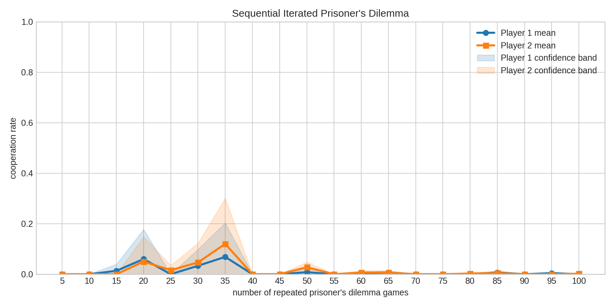

# Sequential Iterated Prisoner's Dilemma

## Overview

This project studies a sequential iterated Prisoner's Dilemma with two independent learning agents using RLlib 2.54.0. Policies are learned via self-play.

## Environment and MARL Setup

- Environment class: `envs/prisoners_dilemma_env.py`
- Agent IDs: `player_1`, `player_2`
- Action space: `0=cooperate`, `1=defect`
- Reward matrix:
  - `(C, C) -> (3, 3)`
  - `(C, D) -> (0, 5)`
  - `(D, C) -> (5, 0)`
  - `(D, D) -> (1, 1)`
- Turn order is sequential each round: Player 1 then Player 2
- Horizon modes: `fixed`, `random_revealed`, `random_continuation`
- Two independent RLlib policies are trained:
  - `policy_player_1` for `player_1`
  - `policy_player_2` for `player_2`

## Game Dynamics

<div align="center">
  
  <p><strong>Display 1: The reward after each round.</strong></p>
</div>

Each episode is a repeated game with one of three horizon regimes:

1. `fixed`: always run exactly `max_rounds`.
2. `random_revealed`: sample episode horizon in `[min_rounds, max_rounds]` and reveal it via observation progress/info.
3. `random_continuation`: after each round (after `min_rounds`), continue with probability `continuation_prob`; stop otherwise.

## Research Question and Hypotheses

This project is best framed as a finite-horizon RL question, not as a direct equilibrium solver.

- Research question:
  - In a fixed-horizon iterated Prisoner's Dilemma, do independently trained PPO agents converge to backward-induction-like defection, or to cooperative conventions?
- Hypothesis H1 (game-theoretic target):
  - If learning approximates subgame-perfect play, defection probability should be high from early rounds and remain high.
- Hypothesis H2 (RL/self-play behavior):
  - With function approximation and self-play dynamics, agents may sustain cooperation for many rounds and defect only near the end (or remain cooperative throughout).

PPO drawback (important):

- Independent PPO self-play is not an equilibrium-finding algorithm.
- In this setup, each agent optimizes against a moving opponent policy, but PPO does not directly solve the Nash fixed-point condition ("no unilateral profitable deviation").
- As opposed to equilibrium-focused methods (e.g., backward induction, CFR-style methods, or PSRO + best-response checks), PPO alone does not provide equilibrium guarantees.

Recommended reporting:

- Defection/cooperation rate by round index `t`
- Mean episode return
- Mean rounds (fixed at `max_rounds` by design)
- Multiple random seeds (to detect equilibrium-selection effects)

## Historical Background (Rapoport / Axelrod)

- Anatol Rapoport is closely associated with Tit-for-Tat in repeated Prisoner's Dilemma research, including work with Albert Chammah in the 1960s.
- In 1980 and 1981, political scientist Robert Axelrod ran computer tournaments for iterated Prisoner's Dilemma strategies.
- Rapoport submitted Tit-for-Tat, and it ranked first in both tournaments.
- Axelrod's 1984 book *The Evolution of Cooperation* made these results widely known and influential.

## Tuning and Evaluation (RLlib 2.54.0)

Install dependencies:

```bash
python -m pip install -r requirements.txt
```

PPO hyperparameters are defined in:

- `config/config_ppo.py` (`config_ppo` dict)
- Runtime/environment settings are defined in `config/config_env.py` (`config_env` dict)

Tune/eval will load both files by default, so you can configure everything in one place.
This includes new-stack resource settings such as:
`num_learners`, `num_gpus_per_learner`, `num_env_runners`, `num_envs_per_env_runner`,
`num_cpus_per_env_runner`, and `num_cpus_for_main_process`.
Core new-stack PPO keys follow PredPreyGrass naming, e.g.
`train_batch_size_per_learner`, `minibatch_size`, `num_epochs`, `rollout_fragment_length`.
Set `tune_iters` in this same config file to control total Tune iterations.
Legacy aliases are intentionally not supported anymore.

Tune with two independent policies and evaluate:

```bash
python scripts/tune_eval_rllib.py
```

Evaluate only from a saved checkpoint:

- Set `from_checkpoint` in `config/config_env.py` to your checkpoint path.

Use a different PPO hyperparameter file:

- Set `ppo_config` in `config/config_env.py`.

Write machine-readable metrics for plotting or post-analysis:

- Set `metrics_out` in `config/config_env.py`.

Useful options:

- Adjust `max_rounds`, `min_rounds`, `horizon_mode`, and `continuation_prob` in `config/config_env.py`.

## Experiment: Fixed Horizon (50 Rounds)

Goal:

- Test whether the finite-horizon setup converges to all-defect behavior.

```bash
python scripts/tune_eval_rllib.py
```

Observed eval summary:

- `mean_episode_reward`: `player_1=50.0`, `player_2=50.0`
- `cooperation_rate`: `player_1=0.0`, `player_2=0.0`
- `mean_rounds_per_episode`: `50.0`

Interpretation:

- This matches all-defect over 50 rounds: each round yields `(D,D) -> (1,1)`, totaling `50` per agent.
- This is the expected finite-horizon baseline in the standard window-less setup.

## Robust Tuning and Stability Checks

Single-run results can look good while still being unstable across random seeds. Use a multi-seed sweep to
check whether behavior is actually robust.

Recommended robust baseline:

- Increase `tune_iters` in `config/config_ppo.py` (for example, `100` to `300`)
- Set robust PPO defaults in `config/config_ppo.py`
- Evaluate with enough episodes (`eval_episodes` in `config/config_env.py`)
- Report aggregate stats over multiple seeds

Run a stability sweep:

```bash
python scripts/stability_sweep.py \
  --num-seeds 8 \
  --seed-start 0 \
  --eval-episodes 100 \
  --horizon-mode fixed \
  --max-rounds 50
```

`stability_sweep.py` now also auto-scales PPO batch settings by `max_rounds`
to keep update statistics more comparable across horizon choices:

- `train_batch_size_per_learner = max(1024, 64 * (2 * max_rounds))`
- `minibatch_size = max(128, train_batch_size_per_learner // 8)` (rounded to a multiple of 32)
- `num_epochs = 15` for smaller batches, `10` when `train_batch_size_per_learner >= 8192`

Each seed run gets its own generated `config_ppo.py` with these effective values.
During stability sweeps, these three keys override the corresponding values from the base
`config/config_ppo.py` for fairness across horizons.

To change PPO hyperparameters/resources, edit `config/config_ppo.py` and rerun.

If RLlib is installed in a project-local interpreter, set it explicitly:

```bash
python scripts/stability_sweep.py --python-executable ./.conda/bin/python
```

Output:

- Per-seed artifacts in `checkpoints/stability_sweep/seed_<seed>/`
- Per-seed generated PPO config in `checkpoints/stability_sweep/seed_<seed>/config_ppo_<timestamp>.py`
- Per-seed generated env config in `checkpoints/stability_sweep/seed_<seed>/config_env_<timestamp>.py`
- Per-seed metrics in `checkpoints/stability_sweep/seed_<seed>/metrics_<timestamp>.json`
- Aggregate summary in `checkpoints/stability_sweep/summary_<timestamp>.json`
- Automatic `STABLE`/`UNSTABLE` verdict based on:
  - reward CV across seeds
  - cooperation-rate std across seeds
  - rounds-per-episode CV across seeds
  - mean player reward gap

## Sweep Max Rounds vs Cooperation

Sweep these max-round values and plot both players' cooperation rates:

`[5, 10, 15, 20, 25, 30, 35, 40, 45, 50, 55, 60, 65, 70, 75, 80, 85, 90, 95, 100]`

```bash
python scripts/sweep_max_rounds_cooperation.py
```

Set sweep seed/CI controls in `config/config_env.py` under `config_sweep_max_rounds`:

- `num_seeds`
- `seed_start`
- `ci_level`

To keep PPO updates comparable across horizons, the sweep now auto-scales batch settings
per `max_rounds` by generating a per-run `config_ppo.py`:

- `train_batch_size_per_learner = max(1024, 64 * (2 * max_rounds))`
- `minibatch_size = max(128, train_batch_size_per_learner // 8)` (rounded to a multiple of 32)
- `num_epochs = 15` for smaller batches, `10` when `train_batch_size_per_learner >= 8192`

This keeps the number of complete episodes per PPO update more stable as episode length grows.
During this max-round sweep, these three keys override the corresponding values from the base
`config/config_ppo.py`.
For each `max_rounds`, the script now runs multiple seeds, computes mean cooperation per player,
and plots confidence bands around each mean curve.

Outputs:

- Per-round runs in `checkpoints/max_rounds_cooperation_sweep/max_rounds_<value>/`
- Per-round, per-seed generated PPO config in `checkpoints/max_rounds_cooperation_sweep/max_rounds_<value>/seed_<seed>/config_ppo_<timestamp>.py`
- Per-round, per-seed generated env config in `checkpoints/max_rounds_cooperation_sweep/max_rounds_<value>/seed_<seed>/config_env_<timestamp>.py`
- Per-round, per-seed metrics in `checkpoints/max_rounds_cooperation_sweep/max_rounds_<value>/seed_<seed>/metrics_<timestamp>.json`
- Plot in `checkpoints/max_rounds_cooperation_sweep/cooperation_vs_max_rounds_<timestamp>.png`
- Summary JSON in `checkpoints/max_rounds_cooperation_sweep/summary_<timestamp>.json`

Result incorporated here:

- Plot file: `checkpoints/max_rounds_cooperation_sweep/cooperation_vs_max_rounds_20260303_111907_840197.png`
- Summary file: `checkpoints/max_rounds_cooperation_sweep/summary_20260303_111907_840197.json`
- Seeds: `[0, 1, 2, 3, 4]` (5 runs per `max_rounds`)
- Confidence level: `95%`

<div align="center">
  
  <p><strong>Display 2: Mean cooperation rates (5 seeds) across the number of repeated prisoner's dilemma games, with 95% confidence bands.</strong></p>
</div>

Observed result (this run):

- Cooperation is mostly near zero for many horizons (`5, 10, 40, 45, 55, 70, 75, 90` are exactly `0.0` for both or nearly both players).
- The strongest cooperation bump is at `max_rounds=35`:
  - `player_1 mean = 0.0686` with `95% CI [-0.066, 0.203]`
  - `player_2 mean = 0.1200` with `95% CI [-0.061, 0.301]`
- Smaller non-zero means appear around `20-35` and at a few isolated longer horizons (`50`, `85`, `95`), but values remain low overall.
- Confidence bands are often wide relative to the mean and usually include `0`, indicating substantial seed sensitivity and weak evidence for stable cooperation at those points.

Interpretation:

- This run is closer to "mostly defection with occasional local cooperation windows" than to stable broad cooperation across long horizons.
- The result still illustrates the RL-vs-theory gap: independent PPO can produce pockets of cooperative behavior, but here those pockets are small and not robust across seeds.

How the sweep mechanism works end-to-end:

1. Load base environment settings from `config_env` and sweep controls from `config_sweep_max_rounds` in `config/config_env.py`.
2. Read the list of `max_rounds` values to evaluate.
3. For each `max_rounds` and each seed, generate timestamped per-seed files:
   - `config_env_<timestamp>.py`
   - `config_ppo_<timestamp>.py`
   - `metrics_<timestamp>.json`
4. Apply horizon-aware PPO scaling per `max_rounds`:
   - `train_batch_size_per_learner = max(1024, 64 * (2 * max_rounds))`
   - `minibatch_size = max(128, train_batch_size_per_learner // 8)` (rounded to multiple of 32)
   - `num_epochs = 15` or `10` for large batches
5. Run `scripts/tune_eval_rllib.py` for each seed and collect cooperation metrics.
6. Aggregate by `max_rounds`:
   - mean cooperation per player
   - standard deviation
   - confidence interval (normal approximation)
7. Plot mean lines plus confidence bands for both players.
8. Write timestamped aggregate outputs:
   - `cooperation_vs_max_rounds_<timestamp>.png`
   - `summary_<timestamp>.json`
