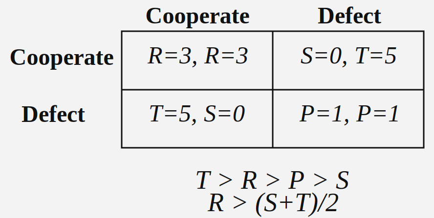

# Repeated Prisoner's Dilemma

## Overview

This project studies a repeated Prisoner's Dilemma with two independent reinforcement learning agents. The algorithm used is PPO via RLlib 2.54.0. 

## Environment and MARL Setup

- Environment class: `envs/prisoners_dilemma_env.py`
- Agent IDs: `player_1`, `player_2`
- Action space: `0=cooperate`, `1=defect`
- Reward matrix:
  - `(C, C) -> (3, 3)`
  - `(C, D) -> (0, 5)`
  - `(D, C) -> (5, 0)`
  - `(D, D) -> (1, 1)`
- Actions are chosen simultaneously each round (both actions provided in one env step)
- Two independent RLlib policies are trained:
  - `policy_player_1` for `player_1`
  - `policy_player_2` for `player_2`

## Game Dynamics

<div align="center">
  
  <p><strong>Display 1: The reward after each round.</strong></p>
</div>

Each episode is a repeated game with a fixed horizon:

1. `fixed`: always run exactly `n_sequential_games`.

## Research Question and Hypotheses

This project is best framed as a finite-horizon RL question, not as a direct equilibrium solver.

- Research question:
  - In a fixed-horizon iterated Prisoner's Dilemma, do independently trained PPO agents converge to backward-induction-like defection, or to cooperative conventions?
- Hypothesis H1 (game-theoretic target):
  - If learning approximates subgame-perfect play, defection probability should be high from early rounds and remain high.
- Hypothesis H2 (RL/self-play behavior):
  - With function approximation and self-play dynamics, agents may sustain cooperation for many rounds and defect only near the end (or remain cooperative throughout).

PPO drawback (important):

- Independent PPO self-play is not an equilibrium-finding algorithm.
- In this setup, each agent optimizes against a moving opponent policy, but PPO does not directly solve the Nash fixed-point condition ("no unilateral profitable deviation").
- As opposed to equilibrium-focused methods (e.g., backward induction, CFR-style methods, or PSRO + best-response checks), PPO alone does not provide equilibrium guarantees.

Recommended reporting:

- Defection/cooperation rate by round index `t`
- Mean episode return
- Mean rounds (fixed at `n_sequential_games` by design)
- Multiple random seeds (to detect equilibrium-selection effects)

## Tuning and Evaluation (RLlib 2.54.0)

Install dependencies:

```bash
python -m pip install -r requirements.txt
```

PPO hyperparameters are defined in:

- `config/config_ppo.py` (`config_ppo` dict)
- Runtime/environment settings are defined in `config/config_env.py` (`config_env` dict)

Tune/eval will load both files by default, so you can configure everything in one place.
This includes new-stack resource settings such as:
`num_learners`, `num_gpus_per_learner`, `num_env_runners`, `num_envs_per_env_runner`,
`num_cpus_per_env_runner`, and `num_cpus_for_main_process`.
Core new-stack PPO keys follow PredPreyGrass naming, e.g.
`train_batch_size_per_learner`, `minibatch_size`, `num_epochs`, `rollout_fragment_length`.
Set `tune_iters` in this same config file to control total Tune iterations.
Legacy aliases are intentionally not supported anymore.

Tune with two independent policies and evaluate:

```bash
python -m scripts.tune_eval_rllib
```

Evaluate only from a saved checkpoint:

- Set `from_checkpoint` in `config/config_env.py` to your checkpoint path.

Use a different PPO hyperparameter file:

- Set `ppo_config` in `config/config_env.py`.

Write machine-readable metrics for plotting or post-analysis:

- Set `metrics_out` in `config/config_env.py`.

Useful options:

- Adjust `n_sequential_games` in `config/config_env.py`.

Defection-gain check (approximate exploitability-style):

```bash
python -m scripts.check_defection_gain
```

Configure this via `config_defection_gain_check` in `config/config_env.py`:

- `checkpoint`
- `checkpoint_root`
- `n_sequential_games`
- `episodes`
- `seed`
- `output_json`
- `gain_tol`

`checkpoint` supports automatic latest-run selection:

- Use `"latest"` (or `"auto"`) to pick the newest checkpoint under `checkpoint_root`.

Interpretation:

- `gain_player_1_defect > 0` means player 1 can improve by unilaterally switching to always-defect against fixed player 2.
- `gain_player_2_defect > 0` means player 2 can improve by unilaterally switching to always-defect against fixed player 1.
- If both gains are near `<= 0` (within tolerance), the checkpoint is more consistent with an all-defect equilibrium-like outcome.

## Experiment: Fixed Horizon (50 Rounds)

Goal:

- Test whether the finite-horizon setup converges to all-defect behavior.

```bash
python -m scripts.tune_eval_rllib
```

Observed eval summary:

- `mean_episode_reward`: `player_1=50.0`, `player_2=50.0`
- `cooperation_rate`: `player_1=0.0`, `player_2=0.0`
- `mean_rounds_per_episode`: `50.0`

Interpretation:

- This matches all-defect over 50 rounds: each round yields `(D,D) -> (1,1)`, totaling `50` per agent.
- This is the expected finite-horizon baseline in the standard window-less setup.

## Robust Tuning and Stability Checks

Single-run results can look good while still being unstable across random seeds. Use a multi-seed sweep to
check whether behavior is actually robust.

Recommended robust baseline:

- Increase `tune_iters` in `config/config_ppo.py` (for example, `100` to `300`)
- Set robust PPO defaults in `config/config_ppo.py`
- Evaluate with enough episodes (`eval_episodes` in `config/config_env.py`)
- Report aggregate stats over multiple seeds

Run a stability sweep:

```bash
python -m scripts.stability_sweep
```

Configure this via `config_stability_sweep` in `config/config_env.py`:

- `num_seeds`
- `seed_start`
- `output_dir`
- `python_executable`
- `ppo_config`
- `eval_episodes`
- `n_sequential_games`
- `max_reward_cv`
- `max_cooperation_std`
- `max_rounds_cv`
- `max_player_reward_gap`
- `run_defection_gain_check`
- `defection_gain_episodes`
- `defection_gain_tol`

`stability_sweep.py` now also auto-scales PPO batch settings by `n_sequential_games`
to keep update statistics more comparable across round-length settings:

- `train_batch_size_per_learner = max(1024, 64 * n_sequential_games)`
- `minibatch_size = max(128, train_batch_size_per_learner // 8)` (rounded to a multiple of 32)
- `num_epochs = 15` for smaller batches, `10` when `train_batch_size_per_learner >= 8192`

Each seed run gets its own generated `config_ppo.py` with these effective values.
During stability sweeps, these three keys override the corresponding values from the base
`config/config_ppo.py` for fairness across `n_sequential_games` settings.

`stability_sweep.py` can also run per-seed defection-gain checks automatically
(no manual checkpoint insertion):

- set `run_defection_gain_check = True`
- set `defection_gain_episodes`
- set `defection_gain_tol`

To change PPO hyperparameters/resources, edit `config/config_ppo.py` and rerun.

Output:

- Per-seed artifacts in `checkpoints/stability_sweep/seed_<seed>/`
- Per-seed generated PPO config in `checkpoints/stability_sweep/seed_<seed>/config_ppo_<timestamp>.py`
- Per-seed generated env config in `checkpoints/stability_sweep/seed_<seed>/config_env_<timestamp>.py`
- Per-seed metrics in `checkpoints/stability_sweep/seed_<seed>/metrics_<timestamp>.json`
- Optional per-seed defection-gain payloads in `checkpoints/stability_sweep/seed_<seed>/defection_gain_<timestamp>.json`
- Aggregate summary in `checkpoints/stability_sweep/summary_<timestamp>.json`
- Automatic `STABLE`/`UNSTABLE` verdict based on:
  - reward CV across seeds
  - cooperation-rate std across seeds
  - rounds-per-episode CV across seeds
  - mean player reward gap
  - defection-gain non-positive rate across seeds (when enabled)

## Sweep n_sequential_games vs Cooperation

Sweep these `n_sequential_games` values and plot both players' cooperation rates:

`[5, 10, 15, 20, 25, 30, 35, 40, 45, 50, 55, 60, 65, 70, 75, 80, 85, 90, 95, 100]`

```bash
python -m scripts.sweep_n_sequential_pd
```

Set sweep controls in `config/config_env.py` under `config_sweep_n_sequential_pd`:

- `n_sequential_games_values`
- `output_dir`
- `python_executable`
- `num_seeds`
- `seed_start`
- `ci_level`
- `hypothesis_test_alpha`
- `hypothesis_test_bootstrap_samples`
- `hypothesis_test_bootstrap_seed`
- `hypothesis_test_correction` (`holm` or `none`)

To keep PPO updates comparable across horizons, the sweep now auto-scales batch settings
per `n_sequential_games` by generating a per-run `config_ppo.py`:

- `train_batch_size_per_learner = max(1024, 64 * n_sequential_games)`
- `minibatch_size = max(128, train_batch_size_per_learner // 8)` (rounded to a multiple of 32)
- `num_epochs = 15` for smaller batches, `10` when `train_batch_size_per_learner >= 8192`

This keeps the number of complete episodes per PPO update more stable as episode length grows.
During this `n_sequential_games` sweep, these three keys override the corresponding values from the base
`config/config_ppo.py`.
For each `n_sequential_games` value, the script now runs multiple seeds, computes mean cooperation per player,
and plots confidence bands around each mean curve.

Outputs:

- Per-sweep run root in `checkpoints/sweep_n_sequential_pd/<run_timestamp>/`
- Per-round runs in `checkpoints/sweep_n_sequential_pd/<run_timestamp>/n_sequential_games_<value>/`
- Per-round, per-seed generated PPO config in `checkpoints/sweep_n_sequential_pd/<run_timestamp>/n_sequential_games_<value>/seed_<seed>/config_ppo_<run_timestamp>.py`
- Per-round, per-seed generated env config in `checkpoints/sweep_n_sequential_pd/<run_timestamp>/n_sequential_games_<value>/seed_<seed>/config_env_<run_timestamp>.py`
- Per-round, per-seed metrics in `checkpoints/sweep_n_sequential_pd/<run_timestamp>/n_sequential_games_<value>/seed_<seed>/metrics_<run_timestamp>.json`
- Plot in `checkpoints/sweep_n_sequential_pd/<run_timestamp>/cooperation_vs_n_sequential_games_<run_timestamp>.png`
- Summary JSON in `checkpoints/sweep_n_sequential_pd/<run_timestamp>/summary_<run_timestamp>.json`
- Hypothesis test report in `summary_<run_timestamp>.json` under `hypothesis_testing` and per-result entries under `results[*].hypothesis_tests`

Hypothesis testing details (two-sided + Holm):

1. Unit of analysis:
   - For each horizon `n_sequential_games` and each player separately, use the per-seed cooperation rates as samples.
   - With 20 horizons and 2 players, this yields `40` tests total per sweep run.
2. Null and alternative:
   - `H0`: mean cooperation across seeds is `0`.
   - `H1`: mean cooperation across seeds is not `0` (two-sided).
3. Per-test p-value (bootstrap):
   - Let observed per-seed values be `x_1, ..., x_n` and `m = mean(x)`.
   - Construct a null sample by mean-centering: `x_i^0 = x_i - m` (so the null mean is exactly 0).
   - Draw bootstrap resamples from `{x_i^0}` with replacement, compute bootstrap means `m_b`, and estimate:
     - `p_raw = P(|m_b| >= |m|)` (two-sided tail probability, with +1 smoothing in numerator and denominator).
   - This is robust to non-normal seed distributions.
4. Multiple-testing correction (Holm-Bonferroni):
   - Sort all raw p-values ascending: `p_(1) <= ... <= p_(m)`.
   - Holm-adjust each by rank: `p_adj(i) = max_{j<=i}((m - j + 1) * p_(j))`, clipped to `1`.
   - Compare adjusted p-values to `alpha` (default `0.05`).
   - Reject `H0` only when `p_adj < alpha`.
5. Why Holm:
   - Controls family-wise error rate across all 40 tests.
   - Less conservative than plain Bonferroni while still strict.

How to read the summary JSON:

- Global test block: `hypothesis_testing`
  - `alpha`, `test`, `multiple_testing_correction`, `total_tests`
  - `rejections_after_correction` lists significant `(n, player)` pairs.
  - `rejection_counts_by_player` gives per-player totals.
- Per-horizon block: `results[*].hypothesis_tests`
  - For each player: `sample_size`, `mean`, `raw_p_value`, `adjusted_p_value`, `reject_null`.

Tiny decision-table example (`alpha = 0.05`, Holm correction):

| n_sequential_games | player   | mean cooperation | raw p-value | Holm-adjusted p-value | reject_null |
| --- | --- | ---: | ---: | ---: | --- |
| 5   | player_1 | 0.000000 | 1.000000 | 1.000000 | False |
| 50  | player_1 | 0.138000 | 0.001400 | 0.055997 | False |

Reading this:

- `n=50, player_1` has a small **raw** p-value, but after Holm correction it is `0.055997 > 0.05`, so it is not significant at the family-wise level.
- `reject_null=False` means we fail to reject `H0: mean cooperation = 0` for that `(n, player)` under the configured correction.

Result incorporated here:

- Plot file: `checkpoints/sweep_n_sequential_pd/20260305_001911_105156/cooperation_vs_n_sequential_games_20260305_001911_105156.png`
- Summary file: `checkpoints/sweep_n_sequential_pd/20260305_001911_105156/summary_20260305_001911_105156.json`
- Seeds: `[0, 1, ..., 19]` (20 runs per `n_sequential_games` value)
- Confidence level: `95%`

<div align="center">
  
  <p><strong>Display 2: Mean cooperation rates (20 seeds) across the number of repeated prisoner's dilemma games, with 95% confidence bands.</strong></p>
</div>

Observed result (this run):

- Cooperation is not uniformly near zero: both players exceed `0.10` at `n_sequential_games = 50` and `65`.
- The largest cooperation windows are:
  - `n_sequential_games=50`: `player_1 mean = 0.138` (`95% CI [0.050, 0.226]`), `player_2 mean = 0.116` (`95% CI [0.037, 0.195]`)
  - `n_sequential_games=65`: `player_1 mean = 0.128` (`95% CI [0.035, 0.222]`), `player_2 mean = 0.115` (`95% CI [0.022, 0.209]`)
  - `n_sequential_games=35`: `player_1 mean = 0.084` (`95% CI [-0.003, 0.172]`), `player_2 mean = 0.136` (`95% CI [0.008, 0.263]`)
  - `n_sequential_games=75`: `player_1 mean = 0.077` (`95% CI [-0.004, 0.158]`), `player_2 mean = 0.121` (`95% CI [0.009, 0.233]`)
- Low-cooperation settings still exist: both means are `<= 0.01` at `n_sequential_games = 5, 10, 15, 25`.
- Confidence intervals include `0` for about half of the horizons (`10/20` for player 1, `9/20` for player 2), indicating substantial seed sensitivity.
- Under two-sided hypothesis tests with Holm correction over 40 tests, no `(n, player)` pair is significant at `alpha=0.05` in this run.

Interpretation:

- With 20 seeds, cooperative pockets remain visible at specific horizons instead of disappearing into pure all-defect behavior.
- The horizon effect is non-monotonic: cooperation rises in some mid/high ranges (`35`, `50`, `65`, `75`) but drops near zero in others.
- Independent PPO still does not produce a uniformly robust cooperation profile across all horizons.

How the sweep mechanism works end-to-end:

1. Load base environment settings from `config_env` and sweep controls from `config_sweep_n_sequential_pd` in `config/config_env.py`.
2. Read the list of `n_sequential_games` values to evaluate.
3. For each `n_sequential_games` value and each seed (20 seeds in this run), generate timestamped per-seed files:
   - `config_env_<timestamp>.py`
   - `config_ppo_<timestamp>.py`
   - `metrics_<timestamp>.json`
4. Apply max-round-aware PPO scaling per `n_sequential_games`:
   - `train_batch_size_per_learner = max(1024, 64 * n_sequential_games)`
   - `minibatch_size = max(128, train_batch_size_per_learner // 8)` (rounded to multiple of 32)
   - `num_epochs = 15` or `10` for large batches
5. Run `scripts/tune_eval_rllib.py` for each seed and collect cooperation metrics.
6. Aggregate by `n_sequential_games`:
   - mean cooperation per player
   - standard deviation
   - confidence interval (normal approximation)
7. Run two-sided hypothesis tests per player and horizon (`H0: mean cooperation across seeds = 0`) and apply multiple-testing correction.
8. Plot mean lines plus confidence bands for both players.
9. Write timestamped aggregate outputs:
   - `checkpoints/sweep_n_sequential_pd/<run_timestamp>/cooperation_vs_n_sequential_games_<run_timestamp>.png`
   - `checkpoints/sweep_n_sequential_pd/<run_timestamp>/summary_<run_timestamp>.json`
